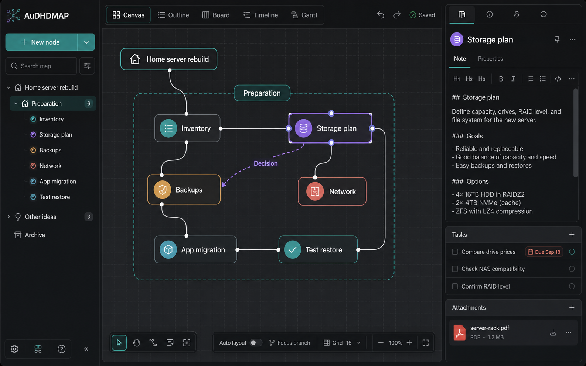
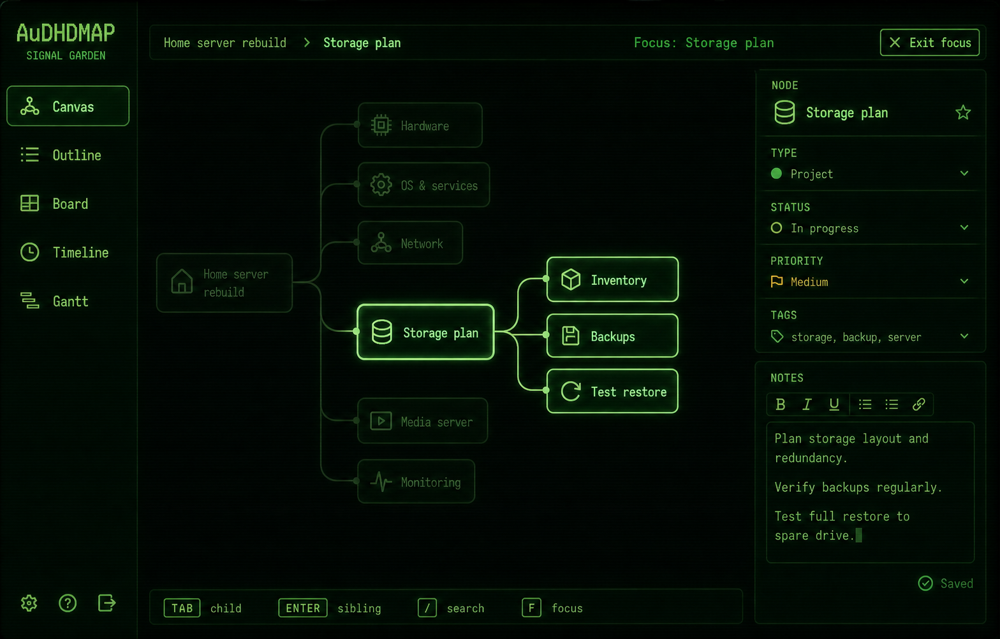
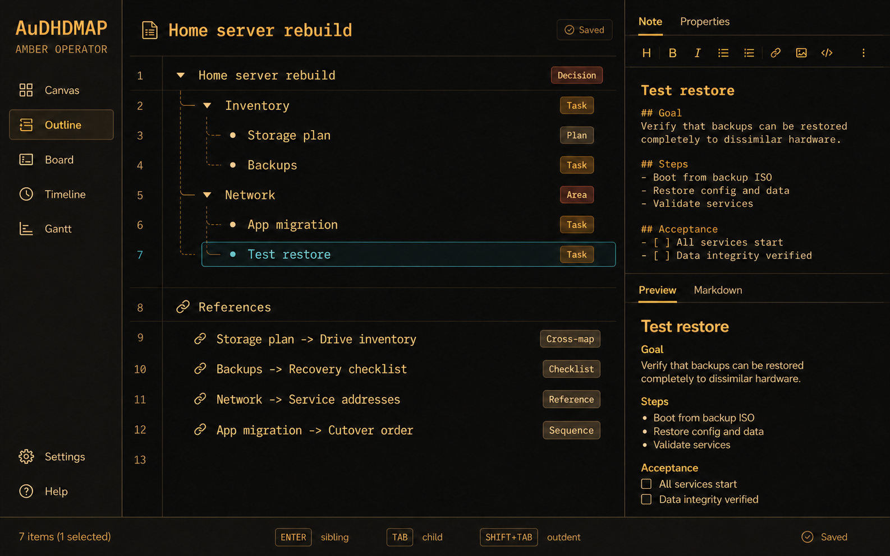
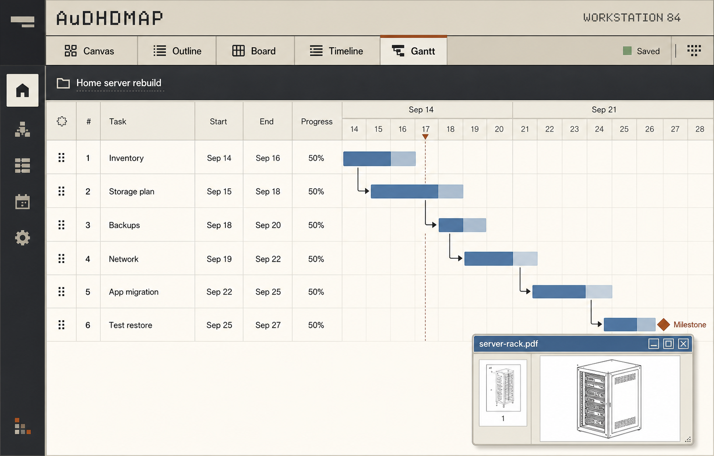
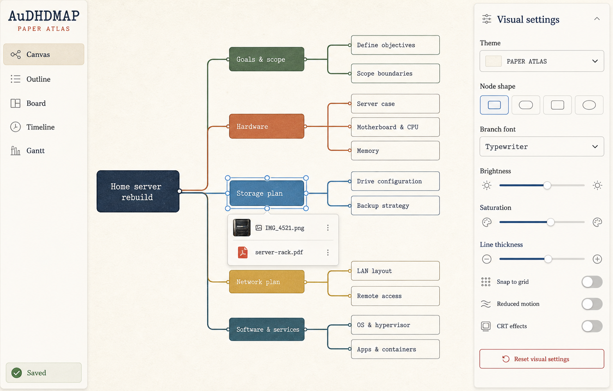

# AuDHDMAP interface mockups

These five mockups compare one product through several themes and views. They are not five separate application structures.

## Mockups

### Quiet Canvas

The default view establishes the shared three-region layout: workspace rail, canvas, and selected-node inspector. It demonstrates free placement, a group boundary, labeled linking, tasks, Markdown notes, attachments, auto-layout, focus mode, and grid snapping.

### Signal Garden

The green CRT theme demonstrates branch focus, a location breadcrumb, a visible exit, dimmed context, and a persistent keyboard guide. CRT effects are visual settings, not required interaction behavior.

### Amber Operator

The amber theme demonstrates the editable Outline view, hierarchy guides, semantic category labels, internal cross-map references, Markdown editing, and rendered preview.

### Workstation 84

The workstation theme demonstrates a project branch rendered as a Gantt chart with dates, progress, dependencies, a milestone, and attachment access.

### Paper Atlas

The paper theme demonstrates predictable tree layout, attachments, and independent visual-comfort controls. The same settings panel remains available in every theme.

## Product decisions visible in the mockups

- Canvas, Outline, Board, Timeline, and Gantt are peer views of the same data.
- View navigation stays in the same place across themes.
- The selected item and saved state remain visible.
- Node category is communicated through label, icon, or shape as well as color.
- Focus mode always provides a visible path back to the full map.
- Project fields extend a thought instead of moving it to a separate task system.
- Attachments remain reachable from map, note, outline, and project views.
- CRT effects remain optional and do not change layout or shortcuts.

The implementation specification is in [PRODUCT-DIRECTION.md](../PRODUCT-DIRECTION.md). The complete built-in ImageGen prompt set is in [PROMPTS.md](PROMPTS.md).
